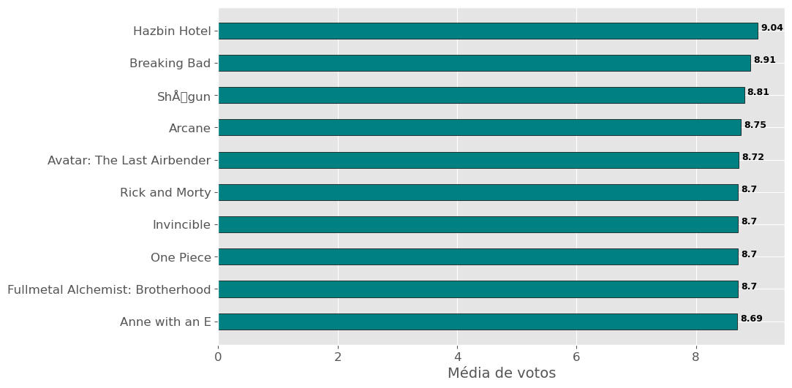
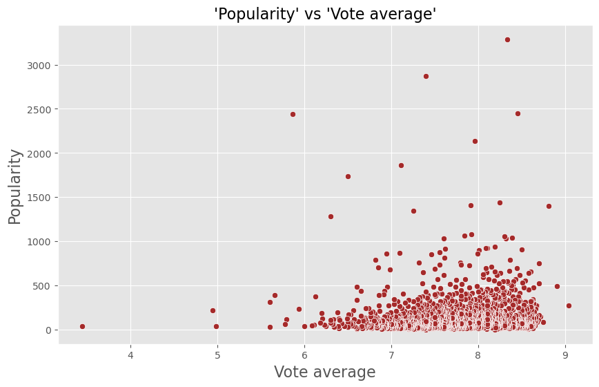
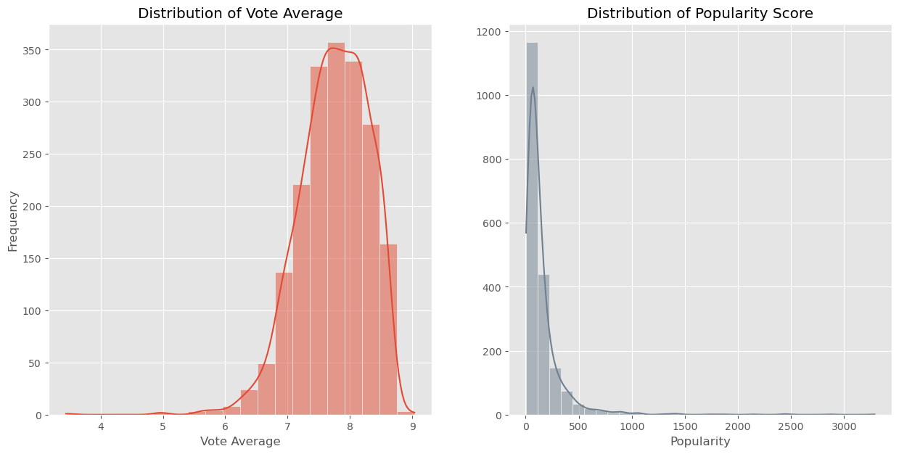

```python
import pandas as pd
import matplotlib.pyplot as plt
plt.style.use('ggplot')
```


```python
plan = pd.read_csv('movies.csv', encoding='utf-8')
#apagar a primeira coluna
plan.drop('Unnamed: 0', axis=1, inplace=True)
plan
```


<div>
<style scoped>
    .dataframe tbody tr th:only-of-type {
        vertical-align: middle;
    }

    .dataframe tbody tr th {
        vertical-align: top;
    }

    .dataframe thead th {
        text-align: right;
    }
</style>
<table border="1" class="dataframe">
  <thead>
    <tr style="text-align: right;">
      <th></th>
      <th>Id</th>
      <th>Name</th>
      <th>Original_name</th>
      <th>Popularity</th>
      <th>First_air_date</th>
      <th>Vote_average</th>
      <th>Vote_count</th>
    </tr>
  </thead>
  <tbody>
    <tr>
      <th>0</th>
      <td>94954</td>
      <td>Hazbin Hotel</td>
      <td>Hazbin Hotel</td>
      <td>277.966</td>
      <td>18-01-2024</td>
      <td>9.037</td>
      <td>738</td>
    </tr>
    <tr>
      <th>1</th>
      <td>1396</td>
      <td>Breaking Bad</td>
      <td>Breaking Bad</td>
      <td>492.705</td>
      <td>20-01-2008</td>
      <td>8.906</td>
      <td>13285</td>
    </tr>
    <tr>
      <th>2</th>
      <td>126308</td>
      <td>ShÅgun</td>
      <td>ShÅgun</td>
      <td>1403.663</td>
      <td>27-02-2024</td>
      <td>8.807</td>
      <td>279</td>
    </tr>
    <tr>
      <th>3</th>
      <td>94605</td>
      <td>Arcane</td>
      <td>Arcane</td>
      <td>89.432</td>
      <td>06-11-2021</td>
      <td>8.749</td>
      <td>3668</td>
    </tr>
    <tr>
      <th>4</th>
      <td>37854</td>
      <td>One Piece</td>
      <td>ワンピース</td>
      <td>164.547</td>
      <td>20-10-1999</td>
      <td>8.700</td>
      <td>4368</td>
    </tr>
    <tr>
      <th>...</th>
      <td>...</td>
      <td>...</td>
      <td>...</td>
      <td>...</td>
      <td>...</td>
      <td>...</td>
      <td>...</td>
    </tr>
    <tr>
      <th>1920</th>
      <td>4551</td>
      <td>America's Got Talent</td>
      <td>America's Got Talent</td>
      <td>314.937</td>
      <td>21-06-2006</td>
      <td>5.600</td>
      <td>239</td>
    </tr>
    <tr>
      <th>1921</th>
      <td>90755</td>
      <td>The I-Land</td>
      <td>The I-Land</td>
      <td>35.172</td>
      <td>12-09-2019</td>
      <td>5.600</td>
      <td>233</td>
    </tr>
    <tr>
      <th>1922</th>
      <td>130392</td>
      <td>The D'Amelio Show</td>
      <td>The D'Amelio Show</td>
      <td>38.377</td>
      <td>03-09-2021</td>
      <td>4.987</td>
      <td>678</td>
    </tr>
    <tr>
      <th>1923</th>
      <td>10160</td>
      <td>Big Brother</td>
      <td>Big Brother</td>
      <td>217.767</td>
      <td>05-07-2000</td>
      <td>4.948</td>
      <td>212</td>
    </tr>
    <tr>
      <th>1924</th>
      <td>126725</td>
      <td>Velma</td>
      <td>Velma</td>
      <td>39.624</td>
      <td>12-01-2023</td>
      <td>3.444</td>
      <td>250</td>
    </tr>
  </tbody>
</table>
<p>1925 rows × 7 columns</p>
</div>


```python
df = plan.copy()

#organizar o dataframe pela coluna 'Vote_average'
df = df.sort_values(by='Vote_average', ascending=False)
df = df[:10].reset_index(drop=True)
#arredondar os valores da coluna 'Vote_average' para 2 casas decimais
df['Vote_average'] = df['Vote_average'].round(2)
# df

fig, ax = plt.subplots(figsize=(10,6))
#plotar um grafico de barras com a coluna y = 'Name' e x = 'Vote_average'
ax.barh(df['Name'], df['Vote_average'], height=0.5, color='teal', edgecolor='black')
ax.invert_yaxis()
plt.yticks(fontsize=12)
plt.xticks(fontsize=12)

plt.xlabel('Média de votos', fontsize=14)

#mostrar o valor maximo no topo de cada coluna
for i, v in enumerate(df['Vote_average']):
    ax.text(v + 0.05, i, str(v), color='black', fontweight='bold', fontsize=9)


plt.show()
```

    c:\Users\LUCAS ROCHA\anaconda3\lib\site-packages\matplotlib\backends\backend_agg.py:240: RuntimeWarning: Glyph 61837 missing from current font.
      font.set_text(s, 0.0, flags=flags)
    c:\Users\LUCAS ROCHA\anaconda3\lib\site-packages\matplotlib\backends\backend_agg.py:203: RuntimeWarning: Glyph 61837 missing from current font.
      font.set_text(s, 0, flags=flags)
    


    

    


```python
df = plan.copy()
# df = df[df['Popularity'] < 1000]

fig, ax = plt.subplots(figsize=(10,6))
ax.scatter(y='Popularity', x='Vote_average', data=df, color='brown', edgecolors='white')
# ax.scatter(y='Popularity', x='Vote_average', data=df, cmap='Greys')
ax.set_xlabel('Vote average', fontsize=16)
ax.set_ylabel('Popularity', fontsize=16)
ax.set_title("'Popularity' vs 'Vote average'", fontsize=16)

plt.show()
```


    

    


```python
import seaborn as sns

fig, ax = plt.subplots(1,2, figsize=(15, 7))
# plt.figure(figsize=(10, 6))
sns.histplot(data=df['Vote_average'], bins=20, kde=True, ax=ax[0])
#colocar titulo no ax[0]
ax[0].set_title('Distribution of Vote Average')
ax[0].set_xlabel('Vote Average')
ax[0].set_ylabel('Frequency')

sns.histplot(data=df['Popularity'], bins=30, kde=True, ax=ax[1], color='slategrey')
ax[1].set_title('Distribution of Popularity Score')
ax[1].set_xlabel('Popularity')
ax[1].set_ylabel('')


plt.show()
```


    

    

